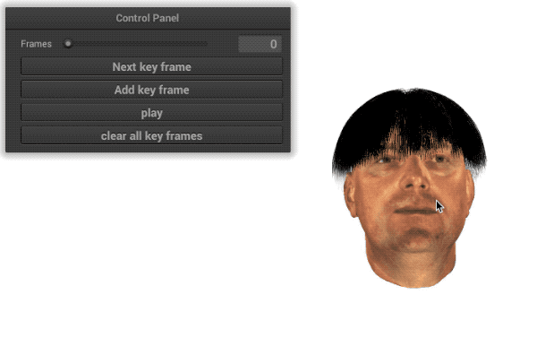
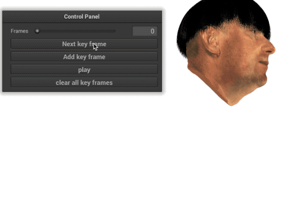

# Hair Simulation using Mass-Spring model
This is a real-time hair simulation project using mass-spring model implemented with C++, OpenGL. A simple UI is included for keyframe animation editing.

# Interaction Guide
* Rotate the head model with left/right mouse button
* Move the model with WASDQE
* Zoom in and out with scroll wheel
* Drag the 'frame bar', edit the model pose, then click 'add key frame' to insert a new key frame. After multiple key frames are inserted, press 'play' to show the result.

# Build Instruction
This project is built with xcode, the libs and include files use the relative path, which shouldn't need extra configuration. However, you may need to add CoreFoundation.framwork, OpenGL.franmwork under the target->General->frameworks and libraries menu. These two files should be pre-installed on your mac.
If the shader files cannot be loaded properly, try to re-include them in the Build Phase section.

This project might be switched to a windows VS build version later.

#Demo
Manipulating head model pose: 
Keyframe animation: 
